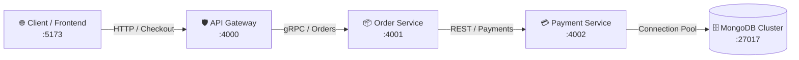

# 🧠 Intelligent AIOps Platform

> **Autonomous Observability, Cross-Boundary Signal Correlation & Generative AI Root Cause Analysis (RCA) with Human-in-the-Loop Remediation**

[](https://reactjs.org/)
[](https://nodejs.org/)
[](https://ai.google.dev/)
[](https://reactflow.dev/)
[]()

---

## 📌 Executive Summary

Modern cloud-native systems suffer from **alert fatigue**, **distributed cascading failures**, and **prolonged Mean Time to Detect/Resolve (MTTD/MTTR)**. When an outage occurs in a microservice dependency chain, hundreds of duplicate alarms trigger simultaneously across dashboards.

**Intelligent AIOps** solves this by unifying:
1. **Real-Time Dependency Topology Mapping**: Dynamic graph visualization showing microservice health, call directionality, and cascading degradation.
2. **Multi-Source Telemetry Correlation**: Ingestion and algorithmic grouping of Prometheus metrics, Loki application logs, and service probe events.
3. **AI-Driven Root Cause Analysis (RCA)**: Leveraging **Google Gemini LLM** combined with **Retrieval-Augmented Generation (RAG)** over Standard Operating Procedures (SOPs) to pinpoint the exact failure origin within seconds.
4. **Human-in-the-Loop (HITL) Autonomous Remediation**: Actionable remediation generation with operator approval, automated execution, and instantaneous cluster health recovery.

---

## 🏛️ System Architecture & Call Chain

The platform models and observes a distributed high-throughput commerce cluster:



When **Payment Service** experiences database connection pool exhaustion:
- `payment-service` transitions to **CRITICAL** (Red)
- Downstream RPCs fail, transitioning `order-service` and `gateway-service` to **DEGRADED** (Amber)
- Inter-service edges animate with high-visibility failure dashes
- AI Diagnosis isolates `payment-service` as the causal origin, ignoring the surface-level gateway symptoms.

---

## ✨ Core Features

| Feature | Description |
|---|---|
| **🗺️ Interactive Topology Graph** | Apple-inspired dark mode canvas powered by React Flow with custom squircle nodes, directional dependency arrows, operational probe statuses, and a sliding drawer for deep service inspection. |
| **⚡ Multi-Signal Correlation Engine** | Correlates Prometheus metric anomalies (connection saturation, error spikes, CPU throttles) with Loki error logs using dependency depth analysis. |
| **🧠 Generative AI RCA Engine** | Integrates with **Google Gemini** (`gemini-3.5-flash-lite`, `gemini-2.5-flash`) to generate structured causal chain reports with confidence scoring, evidence citations, and alternative hypotheses. |
| **📚 RAG-Augmented Runbooks** | Built-in semantic vector retrieval matching live cluster telemetry against institutional knowledge runbooks (e.g. *SOP-01 Database Pool Exhaustion*, *SOP-03 High CPU Lag*). |
| **🛡️ Topological Fallback Mode** | Zero-downtime deterministic causal inference based on graph traversal depth when offline or operating without external API keys. |
| **🕹️ Fault Scenario Injector** | Live simulator toolbar allowing instant injection of real failure modes (`db_overload`, `high_cpu`, `downstream_failure`) and observing the system react in real time. |
| **🚀 Verified Remediation** | One-click operator approval executing remediation commands, resetting connection pools, clearing anomalies, and restoring all graph nodes back to **HEALTHY**. |
| **📜 Immutable Audit Trail** | Comprehensive ledger tracking every operator action, automated rollback, timestamp, and recovery status for post-mortem analysis. |

---

## 📂 Project Structure

```bash
Intelligent-AIOps/
├── backend/
│   ├── adapters/
│   │   ├── prometheusAdapter.js   # Prometheus scraper & simulated telemetry baseline
│   │   └── lokiAdapter.js         # Circular buffer log ingestion & querying
│   ├── config/
│   │   ├── topology.js            # Architectural service metadata & dependency chains
│   │   └── gemini.js              # Gemini API client configuration
│   ├── data/
│   │   ├── incidents.json         # Persistent incident records
│   │   ├── audit_logs.json        # Immutable remediation audit logs
│   │   └── settings.json          # Local runtime configuration
│   ├── engine/
│   │   ├── aiReasoning.js         # Gemini LLM prompt synthesis & structured output
│   │   └── correlationEngine.js   # Cross-boundary multi-signal correlation algorithm
│   ├── rag/
│   │   └── runbookEngine.js       # Standard Operating Procedure (SOP) vector index
│   ├── services/
│   │   ├── incidentManager.js     # Incident lifecycle management (CRUD + MTTR)
│   │   └── storage.js             # Atomic JSON file persistence
│   ├── utils/
│   │   └── logger.js              # Monospace structured logging
│   ├── .env.example               # Environment variables template
│   ├── index.js                   # Express REST API & WebSocket server (:5000)
│   └── package.json
│
├── frontend/
│   ├── src/
│   │   ├── components/
│   │   │   ├── Header.jsx         # Apple-style segmented navigation & scenario injector
│   │   │   ├── TopologyView.jsx   # React Flow interactive dependency graph
│   │   │   ├── IncidentsView.jsx  # Prioritized incident queue & metrics dashboard
│   │   │   ├── TelemetryView.jsx  # Live Prometheus metrics stream & Loki log console
│   │   │   ├── RunbooksView.jsx   # SOP knowledge base editor & search
│   │   │   ├── AuditView.jsx      # Historical remediation ledger
│   │   │   ├── RCAModal.jsx       # Gemini Root Cause Analysis modal & HITL approval
│   │   │   └── SettingsModal.jsx  # Model selection & Gemini API key configuration
│   │   ├── App.jsx                # Main application state & polling orchestration
│   │   ├── index.css              # Apple design system (glassmorphism, typography)
│   │   └── main.jsx
│   ├── package.json
│   └── vite.config.js
│
├── .gitignore
└── README.md
```

---

## 🚀 Quick Start Guide

### Prerequisites
- **Node.js** (v18.0.0 or higher)
- **npm** (v9.0.0 or higher)
- (Optional) **Google Gemini API Key** — [Get a free API key here](https://aistudio.google.com/)

---

### 1. Clone the Repository
```bash
git clone https://github.com/mayurZope06/Intelligent-AIOps.git
cd Intelligent-AIOps
```

---

### 2. Configure Backend Environment
```bash
cd backend
cp .env.example .env
```

Edit `backend/.env` with your API credentials (optional — platform includes topological causal fallback):
```env
PORT=5000
NODE_ENV=development
GEMINI_API_KEY=your_gemini_api_key_here
GEMINI_MODEL=gemini-3.5-flash-lite
```

Install backend dependencies and start the Core Engine:
```bash
npm install
npm start
```
> Backend starts on `http://localhost:5000`

---

### 3. Launch Frontend Dashboard
Open a new terminal:
```bash
cd ../frontend
npm install
npm run dev
```
> Frontend application opens at `http://localhost:3001` (or `http://localhost:5173`)

---

## 🕹️ End-to-End Operational Workflow (Demo Script)

To experience the full AIOps lifecycle in action:

1. **Observe Baseline (Healthy)**:
   - Navigate to the **Topology** tab. All nodes (`frontend`, `gateway-service`, `order-service`, `payment-service`, `database`) display green status pills (`HEALTHY`) with calm solid connection lines.

2. **Inject Failure Scenario**:
   - In the top header bar, select the **Test Scenario** dropdown:
     Choose **`Simulate: DB Pool Exhaustion`**.
   - Watch the dependency graph dynamically change:
     - `payment-service` turns **CRITICAL** (Red) with connection pool exhaustion alerts.
     - `order-service` and `gateway-service` turn **DEGRADED** (Amber).
     - Call chain edges turn **RED / AMBER** with animated dashed pulses.

3. **Inspect Telemetry**:
   - Switch to the **Telemetry** tab to observe live Loki logs showing `ConnectionPoolTimeoutException` and `HTTP 502 Bad Gateway` errors correlated in real-time.

4. **Trigger AI Diagnosis**:
   - Click the purple **Run AI Diagnosis** button in the header (or diagnose from the **Incidents** view).
   - The **AI Root Cause Analysis (RCA)** modal opens:
     - **Primary Diagnosis**: Pinpoints `payment-service` pool exhaustion.
     - **Confidence Score**: e.g. `92% confidence` with reasoning.
     - **Causal Chain**: `🚩 payment-service ➔ ↳ gateway-service ➔ ↳ order-service`.
     - **Matched Runbook (RAG)**: Automatically pairs with *SOP: Service Timeout & Cascading Latency*.
     - **Recommended Remediation**: Proposes actionable mitigate command (`POST /api/remediate { action: 'restart_service', service: 'payment-service' }`).

5. **Approve & Remediate (Human-in-the-Loop)**:
   - Click **`Approve & Remediate`**.
   - The platform executes the remediation:
     - The scenario resets to healthy baseline.
     - The incident is marked **RESOLVED**.
     - An immutable entry is committed to the **Audit Trail**.
     - **The dependency graph instantly restores to HEALTHY (All Green)!**

---

## 📡 Core API Reference

| Method | Endpoint | Description |
|---|---|---|
| `GET` | `/api/graph` | Returns live nodes, edges, active anomalies, and health states |
| `GET` | `/api/telemetry/metrics` | Returns aggregated microservice metrics |
| `GET` | `/api/telemetry/logs` | Fetches filtered logs with level and service queries |
| `POST` | `/api/telemetry/simulate` | Activates test failure mode (`db_overload`, `high_cpu`, `none`) |
| `POST` | `/api/analyze` | Initiates Gemini LLM Root Cause Analysis with RAG SOP match |
| `POST` | `/api/remediation/approve` | Executes operator-approved remediation & restores system |
| `GET` | `/api/remediation/audit` | Retrieves immutable audit trail ledger |
| `GET` | `/api/incidents` | Lists all cluster incidents with status/severity filters |
| `GET` | `/api/rag/runbooks` | Retrieves indexed Standard Operating Procedure runbooks |

---

## 🛠️ Technology Stack

- **Frontend**: React 18, Vite, React Flow, Lucide Icons, Vanilla CSS (Glassmorphism design tokens)
- **Backend**: Node.js, Express.js, Axios, CORS, Dotenv
- **AI & RAG Engine**: Google Generative AI SDK (`@google/generative-ai`), Custom Vector RAG Search
- **Telemetry Observability**: Prometheus Exposition Text Parser, Loki In-Memory / HTTP Buffer

---

## 🎓 Academic Information
- **Project**: College Final Year Engineering Capstone Project
- **Domain**: Cloud Computing, Site Reliability Engineering (SRE), Artificial Intelligence for IT Operations (AIOps)
- **License**: MIT
