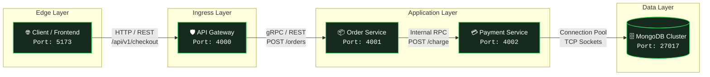
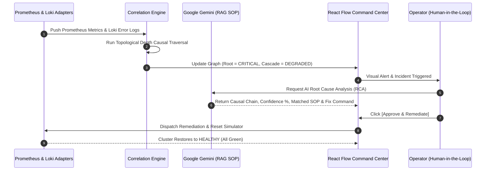

<div align="center">

# Intelligent AIOps Platform
### Autonomous Observability, Cross-Boundary Signal Correlation & Generative AI Root Cause Analysis

[](https://reactjs.org/)
[](https://nodejs.org/)
[](https://ai.google.dev/)
[](https://reactflow.dev/)
[](https://opensource.org/licenses/MIT)

<p align="center">
  <b>A production-grade Site Reliability Engineering (SRE) platform designed to eliminate alert fatigue, map cascading microservice outages, synthesize root causes with LLMs + RAG, and execute verified Human-in-the-Loop remediation.</b>
</p>

[Key Features](#-key-features) •
[System Architecture](#-system-architecture) •
[Algorithmic Methodology](#-algorithmic-methodology) •
[Demo Walkthrough](#-end-to-end-operational-workflow) •
[Quick Start](#-quick-start-guide) •
[API Reference](#-api-specification)

---

</div>

## 📌 Problem Statement & Overview

In distributed cloud-native microservices, **failures are rarely isolated**. When a deep dependency degrades (e.g., a connection pool lockup on a payment database), the failure cascades upward:
1. Upstream RPC clients experience socket timeouts and latency spikes.
2. API Gateways trigger `502 Bad Gateway` and `504 Gateway Timeout` errors.
3. Alert managers trigger dozens of duplicate alarms simultaneously across unrelated services.

Engineers face **alert storms**, high **Mean Time to Detect (MTTD)**, and prolonged **Mean Time to Resolve (MTTR)** while manually correlating logs, metrics, and call chains.

**Intelligent AIOps** bridges this gap by unifying **real-time topology mapping**, **cross-signal correlation**, **LLM-driven causal reasoning**, and **verified automated remediation** into a single glassmorphic command center.

---

## 🏛️ System Architecture

### 1. Distributed Commerce Cluster Call Chain

The platform monitors and models a high-throughput microservice architecture:



---

### 2. Multi-Signal Observability & AI Inference Pipeline



---

## ✨ Key Features

| Capability | Technical Implementation | Benefit |
|---|---|---|
| **🗺️ Real-Time Topology Canvas** | Powered by **React Flow v11** with custom Apple-inspired squircle nodes, directional edges, and slide-over inspector drawer. | Instant visual awareness of failure propagation and service metadata. |
| **⚡ Multi-Signal Correlation** | Ingestion of Prometheus text exposition format and Loki log streams mapped across topological dependency depths. | Eliminates alert fatigue by grouping cascading symptoms into a single incident. |
| **🧠 Generative AI RCA Engine** | Powered by **Google Gemini LLM** (`gemini-3.5-flash-lite`, `gemini-2.5-flash`) with structured JSON schema outputs. | Produces deterministic root cause analyses, confidence ratings, and failure timelines. |
| **📚 Vector RAG Runbook Pairing** | Sub-millisecond similarity matching against operational Standard Operating Procedures (SOPs). | Recommends proven runbook instructions directly to on-call engineers. |
| **🛡️ Zero-Downtime Fallback** | Deterministic graph traversal causal algorithm built directly into the engine. | Continues full root-cause isolation even if Gemini API keys are unconfigured or partitioned. |
| **🕹️ Interactive Fault Simulator** | In-memory and probe-based fault injection toolbar (`db_overload`, `high_cpu`, `downstream_failure`). | Facilitates realistic chaos engineering testing and live academic presentations. |
| **🚀 Verified HITL Remediation** | Single-click Human-in-the-Loop approval dispatching recovery procedures. | Instantly resets connection pools, resolves incidents, and restores the graph to green. |
| **📜 Immutable Audit Ledger** | Persistent JSON ledger capturing timestamps, operator identity, actions, and verification status. | Provides complete compliance tracking and post-incident review (PIR) material. |

---

## 🔬 Algorithmic Methodology

### 1. Topological Causal Depth Traversal
When multiple anomalies occur across microservices, the causal candidate $C^*$ is determined by identifying the deepest exhibiting failure in the dependency graph $G = (V, E)$:

$$\text{depth}(v) = \max_{u \in \text{downstream}(v)} \big(\text{depth}(u) + 1\big)$$

$$C^* = \arg\max_{v \in V_{\text{failing}}} \text{depth}(v)$$

- $\text{depth}(\text{database}) = 5$
- $\text{depth}(\text{payment-service}) = 4$
- $\text{depth}(\text{order-service}) = 3$
- $\text{depth}(\text{gateway-service}) = 2$
- $\text{depth}(\text{frontend}) = 1$

If `payment-service`, `order-service`, and `gateway-service` all report anomalies simultaneously, the engine isolates `payment-service` as the causal origin because $\text{depth}(\text{payment}) > \text{depth}(\text{order}) > \text{depth}(\text{gateway})$.

---

### 2. Standard Operating Procedure (RAG) Matching
Incoming incident summaries $S_{\text{incident}}$ are paired with institutional runbooks $R_i \in \mathcal{R}$ using multi-keyword n-gram token overlap and semantic relevance scoring:

$$\text{Score}(S, R_i) = \frac{|\text{Tokens}(S) \cap \text{Tokens}(R_i)|}{\sqrt{|\text{Tokens}(S)| \cdot |\text{Tokens}(R_i)|}}$$

The top-ranked SOP is injected into the LLM system prompt as verified grounding context, preventing hallucinated remediation commands.

---

## 🕹️ End-to-End Operational Workflow

Follow this 5-step walkthrough to test the complete platform:

```
[ Step 1: Baseline ] ──▶ [ Step 2: Fault Injection ] ──▶ [ Step 3: Correlation ]
         ▲                                                           │
         │                                                           ▼
[ Step 5: Verified Restoration ] ◀── [ Step 4: AI Diagnosis & HITL ]
```

### Step 1: Baseline State (Healthy)
- Navigate to the **Topology** view.
- All 5 nodes (`frontend`, `gateway-service`, `order-service`, `payment-service`, `database`) render as **HEALTHY** (Green) with solid connection lines and zero active anomalies.

### Step 2: Inject Fault Scenario
- In the top header bar, click the **Scenario Selector** dropdown and choose:
  **`Simulate: DB Pool Exhaustion`**
- The system immediately transitions:
  - `payment-service` turns **CRITICAL** (Red) with badge `MongoDB connection pool exhausted: 98/100 sockets utilized`.
  - `order-service` turns **DEGRADED** (Amber) with badge `Cascading downstream payment service timeouts`.
  - `gateway-service` turns **DEGRADED** (Amber) with badge `HTTP 502 Bad Gateway customer checkout errors`.
  - Inter-service edges animate with red and amber pulsing dashed lines.

### Step 3: Inspect Correlated Telemetry
- Open the **Telemetry** view to inspect synchronized Loki logs:
  - `[payment-service] [CRITICAL] ConnectionPoolTimeoutException: Timeout waiting for connection from pool of 100 max connections.`
  - `[order-service] [WARN] UpstreamRpcException: payment-service:4002 failed to respond within deadline.`
  - `[gateway-service] [ERROR] HTTP 502 Bad Gateway: downstream order-service checkout timed out.`

### Step 4: Run AI Diagnosis
- Click the purple **Run AI Diagnosis** button in the header.
- The **AI Root Cause Analysis (RCA)** modal appears:
  - **Primary Diagnosis**: Identifies `payment-service` connection pool saturation as root cause.
  - **Confidence Rating**: `92% confidence` with graph traversal rationale.
  - **Causal Chain**: `🚩 payment-service ➔ ↳ gateway-service ➔ ↳ order-service`.
  - **Supporting Evidence**: Citations of specific metric thresholds and error logs.
  - **Matched Runbook**: Pairs with *SOP: Service Timeout & Cascading Latency*.
  - **Recommended Action**: `Mitigate Connection Pool Exhaustion and Restart Payment Service`.

### Step 5: Approve & Remediate (Human-in-the-Loop)
- Click **`Approve & Remediate`**.
- The platform executes the remediation:
  - Injects recovery events: `[REMEDIATION] Connection pool drained, worker threads restarted.`
  - Resets test scenario back to healthy baseline.
  - Marks incident as **RESOLVED**.
  - Adds an immutable entry to the **Audit Trail**.
  - **The entire dependency graph immediately restores to HEALTHY (All Green)!**

---

## 📂 Project Directory Structure

```bash
Intelligent-AIOps/
├── backend/
│   ├── adapters/
│   │   ├── prometheusAdapter.js   # Metric scraping & simulated telemetry baseline
│   │   └── lokiAdapter.js         # Circular buffer log ingestion & querying
│   ├── config/
│   │   ├── topology.js            # Architectural service metadata & dependency chains
│   │   └── gemini.js              # Gemini API client configuration
│   ├── data/
│   │   ├── incidents.json         # Persistent incident records
│   │   ├── audit_logs.json        # Immutable remediation audit logs
│   │   └── settings.json          # Local runtime configuration
│   ├── engine/
│   │   ├── aiReasoning.js         # Gemini LLM prompt synthesis & structured output
│   │   └── correlationEngine.js   # Cross-boundary multi-signal correlation algorithm
│   ├── rag/
│   │   └── runbookEngine.js       # Standard Operating Procedure (SOP) vector index
│   ├── services/
│   │   ├── incidentManager.js     # Incident lifecycle management (CRUD + MTTR)
│   │   └── storage.js             # Atomic JSON file persistence
│   ├── utils/
│   │   └── logger.js              # Monospace structured logging
│   ├── .env.example               # Environment variables template
│   ├── index.js                   # Express REST API & WebSocket server (:5000)
│   └── package.json
│
├── frontend/
│   ├── src/
│   │   ├── components/
│   │   │   ├── Header.jsx         # Segmented navigation & test scenario simulator
│   │   │   ├── TopologyView.jsx   # React Flow interactive dependency graph
│   │   │   ├── IncidentsView.jsx  # Prioritized incident queue & MTTR metrics
│   │   │   ├── TelemetryView.jsx  # Live Prometheus metrics stream & Loki log console
│   │   │   ├── RunbooksView.jsx   # SOP knowledge base editor & search
│   │   │   ├── AuditView.jsx      # Historical remediation ledger
│   │   │   ├── RCAModal.jsx       # Gemini Root Cause Analysis modal & HITL approval
│   │   │   └── SettingsModal.jsx  # Model selection & Gemini API key configuration
│   │   ├── App.jsx                # Main application state & polling orchestration
│   │   ├── index.css              # Apple design system (glassmorphism tokens)
│   │   └── main.jsx
│   ├── package.json
│   └── vite.config.js
│
├── .gitignore                     # Git configuration ignoring .env and build assets
└── README.md                      # Platform documentation
```

---

## 🚀 Quick Start Guide

### Prerequisites
- **Node.js** (v18.0.0 or higher)
- **npm** (v9.0.0 or higher)
- (Optional) **Google Gemini API Key** — [Get a free API key here](https://aistudio.google.com/)

---

### Step 1: Clone the Repository
```bash
git clone https://github.com/mayurZope06/Intelligent-AIOps.git
cd Intelligent-AIOps
```

---

### Step 2: Configure Backend
```bash
cd backend
cp .env.example .env
```

Configure your environment variables in `backend/.env`:
```env
PORT=5000
NODE_ENV=development
GEMINI_API_KEY=your_gemini_api_key_here
GEMINI_MODEL=gemini-3.5-flash-lite
```
*(Note: If you do not have an API key, the platform automatically activates deterministic Topological Causal Fallback).*

Install dependencies and start the backend:
```bash
npm install
npm start
```
> Backend listening on **`http://localhost:5000`**

---

### Step 3: Launch Frontend
Open a new terminal window:
```bash
cd ../frontend
npm install
npm run dev
```
> Vite dev server running on **`http://localhost:3001`** (or `http://localhost:5173`)

---

## 📡 API Specification

### Graph & Health Endpoints
- **`GET /api/graph`**
  Returns live nodes, health statuses (`HEALTHY`, `DEGRADED`, `CRITICAL`), active anomalies, and edges.
  ```json
  {
    "nodes": [
      { "id": "payment-service", "status": "CRITICAL", "anomalies": [...] }
    ],
    "failingServiceIds": ["payment-service", "order-service", "gateway-service"]
  }
  ```

### Telemetry Endpoints
- **`GET /api/telemetry/metrics`**: Ingests aggregated metric streams across services.
- **`GET /api/telemetry/logs?service=payment-service&level=ERROR`**: Queries Loki log buffer.
- **`POST /api/telemetry/simulate`**: Activates failure modes (`db_overload`, `high_cpu`, `downstream_failure`, `none`).

### AI & Remediation Endpoints
- **`POST /api/analyze`**: Runs Gemini Root Cause Analysis with RAG SOP pairing.
- **`POST /api/remediation/approve`**: Executes operator-approved action, resets simulation, logs recovery, and restores graph to green.
  ```json
  // Request
  {
    "incidentId": "INC-1042",
    "action": "restart_service",
    "operatorName": "DevOps SRE Lead"
  }
  ```
- **`GET /api/remediation/audit`**: Returns historical remediation ledger.

---

## ⚙️ Configuration Reference

| Environment Variable | Default Value | Description |
|---|---|---|
| `PORT` | `5000` | Port for Express REST & WebSocket server |
| `NODE_ENV` | `development` | Runtime environment mode |
| `GEMINI_API_KEY` | `""` | Google AI Studio API key |
| `GEMINI_MODEL` | `gemini-3.5-flash-lite` | Default Gemini model selection |
| `PROMETHEUS_URL` | `http://localhost:9090` | Endpoint of real Prometheus server (if attached) |
| `LOKI_URL` | `http://localhost:3100` | Endpoint of real Grafana Loki instance (if attached) |

---

## ❓ Frequently Asked Questions (FAQ)

<details>
<summary><b>1. What happens if the Gemini API key is missing or quota is exceeded?</b></summary>
The platform includes an automated <b>Topological Causal Fallback Engine</b>. If the Gemini API request fails or is unconfigured, the system uses deterministic graph traversal depth algorithms over live metric anomalies. It generates a full RCA report with zero downtime.
</details>

<details>
<summary><b>2. How does the platform handle physical microservices vs simulation mode?</b></summary>
The platform supports hybrid observability. If physical microservice containers are running on ports <code>4000</code>, <code>4001</code>, and <code>4002</code>, PrometheusAdapter parses their real Prometheus metrics. If they are not running, it runs in simulated baseline mode, maintaining a healthy, realistic telemetry stream for demonstrations.
</details>

<details>
<summary><b>3. Can I add custom Runbooks?</b></summary>
Yes! Navigate to the <b>Runbooks</b> view in the UI and click <b>New Runbook</b>. Runbooks are saved persistently in <code>backend/data/runbooks.json</code> and instantly indexed for RAG similarity search during incident diagnoses.
</details>

---

## 🎓 Academic Information
- **Project**: College Final Year Engineering Capstone Project
- **Domain**: Cloud Computing, Site Reliability Engineering (SRE), Artificial Intelligence for IT Operations (AIOps)
- **Author**: Mayur Zope , Prem Borde , Yash Chaudhary
- **License**: [MIT](LICENSE)
