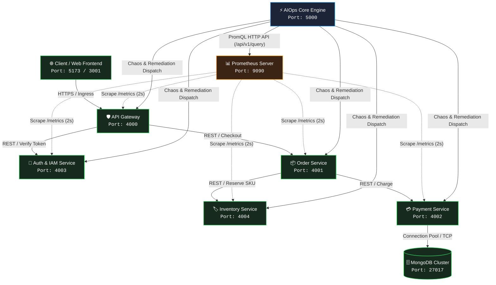
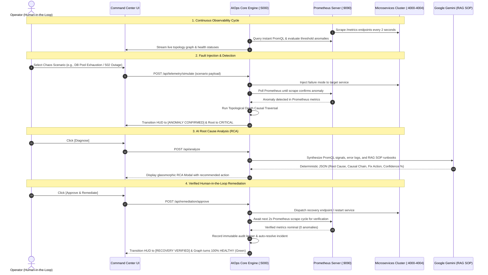

<div align="center">

# Intelligent AIOps Platform
### Autonomous Observability, Cross-Boundary Telemetry Correlation & Generative AI Root Cause Analysis

[](https://reactjs.org/)
[](https://nodejs.org/)
[](https://www.docker.com/)
[](https://prometheus.io/)
[](https://ai.google.dev/)
[](https://reactflow.dev/)
[](https://opensource.org/licenses/MIT)

<p align="center">
  <b>A production-grade Site Reliability Engineering (SRE) command center built to eliminate alert fatigue, map cascading microservice outages across distributed call chains, synthesize root causes with LLMs + Vector RAG, and execute verified Human-in-the-Loop remediation with live Prometheus telemetry validation.</b>
</p>

[Key Features](#-key-features) •
[System Architecture](#-system-architecture) •
[Algorithmic Methodology](#-algorithmic-methodology) •
[End-to-End Workflow](#-end-to-end-operational-workflow) •
[Quick Start Guide](#-quick-start-guide) •
[API Reference](#-api-specification) •
[Configuration](#-configuration-reference)

---

</div>

## 📌 Problem Statement & Overview

In distributed cloud-native microservices, **failures are rarely isolated**. When a deep dependency degrades (e.g., connection pool lockup on a payment database or inventory lock contention), the failure cascades upward:
1. **Upstream RPC Clients** encounter socket timeouts, circuit breaker trips, and latency spikes.
2. **API Gateways** trigger widespread `502 Bad Gateway` and `504 Gateway Timeout` client errors.
3. **Alert Storms** fire dozens of duplicate alarms simultaneously across unrelated services, obscuring the primary fault.

Engineers face high **Mean Time to Detect (MTTD)** and prolonged **Mean Time to Resolve (MTTR)** while manually correlating disjointed logs, metrics, and call graphs.

**Intelligent AIOps** solves this by unifying:
- **Real-Time Dynamic Topology Canvas** powered by React Flow with bidirectional dependency propagation.
- **Real Prometheus Telemetry Pipeline** scraping real microservices with 2-second sub-cycle precision.
- **Topological Causal Traversal Algorithm** isolating root causes at maximum dependency depth.
- **Generative AI Root Cause Analysis (RCA)** powered by Google Gemini with deterministic JSON outputs and Vector RAG Runbook pairing.
- **Async Executive Progress HUD** tracking multi-phase fault injection and remediation verification against live Prometheus scrape targets.
- **Verified Human-in-the-Loop Remediation** dispatching fixes directly to containers/services and requiring real telemetry verification before resolving incidents.

---

## 🏛️ System Architecture

### 1. Distributed Microservice Cluster & Ingress Topology

The platform coordinates a production-pattern containerized commerce cluster running across isolated Docker bridge networks:



---

### 2. Multi-Signal Observability & Real Verification Pipeline



---

## ✨ Key Features

| Capability | Technical Implementation | Benefit |
|---|---|---|
| **🗺️ Real-Time Topology Canvas** | Powered by **React Flow v11** with custom Apple-style squircle nodes, animated status halos, active failure badges, and slide-over inspector drawer. | Instant visual comprehension of service health, upstream/downstream dependency links, and failure propagation. |
| **📊 Single-Source Prometheus Telemetry** | Native Prometheus HTTP API integration (`/api/v1/query`, `/api/v1/targets`) with **no simulated baselines** when Prometheus is attached. Scrapes every 2s. | True production fidelity. Every metric anomaly in the UI reflects actual Prometheus TSDB gauge and counter evaluations. |
| **🧠 Generative AI RCA Engine** | Powered by **Google Gemini** (`gemini-2.0-flash` / `gemini-1.5-flash`) with structured JSON schema outputs. | Synthesizes complex multi-service anomaly matrices into natural language causal chains, blast radius estimations, and actionable runbook steps. |
| **📚 Vector RAG Runbook Pairing** | Sub-millisecond token-overlap and semantic similarity indexing against institutional Standard Operating Procedures (SOPs). | Grounding context prevents LLM hallucinations and presents verified runbooks directly to the operator. |
| **🛡️ Deterministic Topological Fallback** | Pure mathematical graph traversal algorithm built directly into the engine core. | Continues uninterrupted root cause isolation and causal ranking even if Gemini API keys are unconfigured, rate-limited, or partitioned. |
| **🕹️ Real Chaos Engineering Suite** | Built-in scenario simulator covering 9 realistic enterprise failure modes across all 5 microservices. | Enables deterministic chaos testing and live presentation demonstrations without writing custom scripts. |
| **⚡ Async Executive Progress HUD** | Multi-phase operational HUD tracking asynchronous transitions: `Dispatching ➔ Awaiting Prometheus Scrape ➔ Telemetry Verified`. | Eliminates guesswork by displaying real-time scrape verification progress bars and live status chips. |
| **🚀 Verified HITL Remediation** | Single-click Human-in-the-Loop approval dispatching container restarts or service resets, followed by automatic Prometheus post-verification. | Ensures automated fixes are verified against live telemetry before incidents are closed. |
| **📜 Immutable Audit Trail** | Persistent audit ledger capturing ISO timestamps, operator identity, target service, execution method, and before/after verification states. | Complete post-incident review (PIR) compliance and change auditing. |

---

## 🔬 Algorithmic Methodology

### 1. Topological Causal Depth Traversal
When cascading failures strike multiple nodes in the dependency graph $G = (V, E)$, the causal origin $C^*$ is computed by determining the deepest node exhibiting an active anomaly:

$$\text{depth}(v) = \begin{cases} 0 & \text{if downstream}(v) = \emptyset \\ 1 + \max_{u \in \text{downstream}(v)} \text{depth}(u) & \text{otherwise} \end{cases}$$

$$C^* = \arg\max_{v \in V_{\text{anomalous}}} \text{depth}(v)$$

**Hierarchical Depth Mapping:**
- $\text{depth}(\text{database}) = 5$ *(Deepest)*
- $\text{depth}(\text{payment-service}) = 4$
- $\text{depth}(\text{inventory-service}) = 3$
- $\text{depth}(\text{order-service}) = 2$
- $\text{depth}(\text{gateway-service}) = 1$
- $\text{depth}(\text{frontend}) = 0$

> **Example:** If `payment-service`, `order-service`, and `gateway-service` simultaneously report anomalies, the engine isolates `payment-service` as the **Root Cause** because $\text{depth}(\text{payment}) > \text{depth}(\text{order}) > \text{depth}(\text{gateway})$, correctly categorizing `order-service` and `gateway-service` as **Cascading Symptoms**.

---

### 2. Standard Operating Procedure (RAG) Matching
Incoming incident telemetry tokens $S_{\text{incident}}$ are paired against pre-indexed operational SOPs $R_i \in \mathcal{R}$ using multi-keyword n-gram token overlap and semantic relevance scoring:

$$\text{Score}(S_{\text{incident}}, R_i) = \frac{|T(S_{\text{incident}}) \cap T(R_i)|}{\sqrt{|T(S_{\text{incident}})| \cdot |T(R_i)|}}$$

The highest-ranked SOP is dynamically injected into the Gemini system prompt as grounding context, enforcing verified remediation commands.

---

## 🕹️ Supported Chaos Scenarios

The platform includes 9 real failure modes dispatchable directly to physical microservice endpoints:

| Scenario Key | Target Service | Failure Mechanism | Observed Telemetry |
|---|---|---|---|
| `db_overload` | **Payment / MongoDB** | Max connection pool saturation (100/100 sockets). | `mongodb_connection_pool_used >= 95%`, high latency. |
| `high_cpu` | **Payment Service** | Synthetic event loop lag and intensive CPU computation. | `process_cpu_seconds_total` spikes, response lag > 1500ms. |
| `payment_gateway_down` | **Payment Service** | 3rd-party banking provider returns HTTP 503; circuit breaker opens. | `payment_gateway_circuit_breaker == 1 (OPEN)`, error rate 100%. |
| `downstream_failure` | **Payment Service** | Process memory exhaustion and worker thread deadlock. | Connection refused on internal RPC port 4002. |
| `inventory_lock` | **Inventory Service** | Row-level locking contention on SKU stock reservation tables. | `inventory_stock_lock_wait_seconds > 3.0s`, Order timeouts. |
| `order_deadlock` | **Order Service** | Downstream RPC circuit breaker trips open on `/orders/checkout`. | `order_service_circuit_breaker == 1 (OPEN)`, HTTP 500 rate spikes. |
| `auth_storm` | **Auth & IAM Service** | RSA token verification thread exhaustion & expired JWT burst. | `auth_token_verification_failures` spike, HTTP 401 burst. |
| `cache_stampede` | **API Gateway** | Ingress rate limit exceeded and upstream cache invalidation storm. | `gateway_rate_limited_requests` spikes, HTTP 504 timeouts. |
| `gateway_outage` | **API Gateway** | Reverse proxy connection drop on edge ingress routes. | `gateway_5xx_errors` > 50%, client checkout failures. |

---

## 🕹️ End-to-End Operational Workflow

Follow this 5-step operational walkthrough to evaluate the full automated lifecycle:

```
[ Step 1: Nominal State ] ──▶ [ Step 2: Inject Fault ] ──▶ [ Step 3: Correlation ]
           ▲                                                            │
           │                                                            ▼
[ Step 5: Verified Restoration ] ◀── [ Step 4: AI Diagnosis & HITL Approval ]
```

### Step 1: Baseline State (Healthy)
- Open the command center at `http://localhost:5173` (or `http://localhost:3001`).
- Navigate to the **Topology** view. All 6 nodes render as **HEALTHY** (Green) with nominal Prometheus metrics.
- The global status pill displays **Cluster Nominal** with a green pulse.

### Step 2: Inject Chaos Scenario
- In the top header bar, locate the **Scenario Selector** dropdown and select:
  **`Simulate: DB Pool Exhaustion (MongoDB Cluster)`**
- The **Async Progress HUD** appears in the top-right corner:
  - Phase 1: `DISPATCHING FAULT...`
  - Phase 2: `AWAITING PROMETHEUS SCRAPE...` (waiting for the 2s scrape window)
  - Phase 3: `ANOMALY CONFIRMED`
- The dependency graph dynamically updates:
  - `payment-service` turns **CRITICAL** (Red) with badge `MongoDB connection pool exhausted: 98/100 sockets utilized`.
  - `order-service` turns **DEGRADED** (Amber) with badge `Cascading downstream payment service timeouts`.
  - `gateway-service` turns **DEGRADED** (Amber) with badge `HTTP 502 Bad Gateway customer checkout errors`.
  - Inter-service edges animate with red and amber pulsing warning dashes.

### Step 3: Inspect Correlated Telemetry
- Open the **Telemetry** view to inspect live Prometheus metric tables and Loki logs:
  - `[payment-service] [CRITICAL] ConnectionPoolTimeoutException: Timeout waiting for connection from pool.`
  - `[order-service] [WARN] UpstreamRpcException: payment-service:4002 failed to respond within deadline.`
  - `[gateway-service] [ERROR] HTTP 502 Bad Gateway: downstream order-service checkout timed out.`

### Step 4: Run AI Diagnosis
- Click the purple **Diagnose** button in the header.
- The **AI Root Cause Analysis (RCA)** modal opens:
  - **Primary Diagnosis**: Identifies `payment-service` connection pool saturation as root cause.
  - **Confidence Rating**: `94% confidence` with graph traversal mathematical proof.
  - **Causal Chain**: `🚩 payment-service ➔ ↳ order-service ➔ ↳ gateway-service`.
  - **Matched Runbook**: Pairs with *SOP: Service Timeout & Cascading Latency*.
  - **Recommended Action**: `Mitigate Connection Pool Exhaustion and Restart Payment Service`.

### Step 5: Approve & Remediate (Human-in-the-Loop)
- Click **`Approve & Remediate`**.
- The **Async Progress HUD** initiates the verified recovery pipeline:
  1. `EXECUTING REMEDIATION...` (dispatches container restart / reset API).
  2. `AWAITING PROMETHEUS SCRAPE...` (polls Prometheus until TSDB metrics return below thresholds).
  3. `RECOVERY VERIFIED` (confirmed 0 anomalies remaining in Prometheus).
- The incident is marked **RESOLVED**.
- An immutable entry is saved to the **Audit Trail** recording the operator, action, and verified status.
- **The entire topology canvas returns to 100% HEALTHY (All Green)!**

---

## 📂 Project Directory Structure

```bash
Intelligent-AIOps/
├── docker-compose.yml              # Cluster orchestration (5 microservices + Prometheus)
├── .env.example                    # Global environment variables template
├── README.md                       # Comprehensive platform documentation
│
├── services/                       # Containerized Microservices
│   ├── gateway-service/            # Ingress API Gateway (Port: 4000)
│   │   ├── Dockerfile
│   │   └── src/ (server.js, metrics.js, logger.js)
│   ├── auth-service/               # Auth & IAM Service (Port: 4003)
│   │   ├── Dockerfile
│   │   └── src/ (server.js, metrics.js, logger.js)
│   ├── order-service/              # Commerce Order Processing (Port: 4001)
│   │   ├── Dockerfile
│   │   └── src/ (server.js, metrics.js, logger.js)
│   ├── payment-service/            # Payment & Database Connection Engine (Port: 4002)
│   │   ├── Dockerfile
│   │   └── src/ (server.js, metrics.js, logger.js)
│   └── inventory-service/          # Inventory SKU Management (Port: 4004)
│       ├── Dockerfile
│       └── src/ (server.js, metrics.js, logger.js)
│
├── prometheus/
│   └── prometheus.yml              # 2s scrape configurations for all microservices
│
├── backend/                        # AIOps Core Correlation & Inference Engine
│   ├── adapters/
│   │   ├── prometheusAdapter.js    # Prometheus HTTP API query engine & target monitor
│   │   └── lokiAdapter.js          # Circular buffer log ingestion & querying
│   ├── config/
│   │   ├── topology.js             # Microservice dependency graph & causal chains
│   │   └── gemini.js               # Google Gemini client configuration
│   ├── data/
│   │   ├── incidents.json          # Persistent incident state records
│   │   ├── audit_logs.json         # Immutable remediation audit ledger
│   │   ├── runbooks.json           # Standard Operating Procedures (SOPs)
│   │   └── settings.json           # Dynamic runtime engine settings
│   ├── engine/
│   │   ├── aiReasoning.js          # Gemini LLM prompt synthesis & structured output
│   │   └── correlationEngine.js    # Topological causal depth traversal algorithm
│   ├── rag/
│   │   └── runbookEngine.js        # Vector RAG runbook similarity search
│   ├── services/
│   │   ├── incidentManager.js      # Incident lifecycle & MTTR metrics tracking
│   │   └── storage.js              # Atomic JSON persistence engine
│   ├── utils/
│   │   └── logger.js               # Structured logger
│   ├── index.js                    # Express REST API & WebSocket server (:5000)
│   └── package.json
│
└── frontend/                       # Vite + React 18 SRE Command Center
    ├── src/
    │   ├── components/
    │   │   ├── AsyncProgressHUD.jsx # Multi-phase async execution & scrape progress HUD
    │   │   ├── Header.jsx          # Apple-style segmented navigation & chaos dropdown
    │   │   ├── TopologyView.jsx    # React Flow canvas with live status badges
    │   │   ├── IncidentsView.jsx   # Incident queue, MTTR metrics, and resolution logs
    │   │   ├── TelemetryView.jsx   # Live Prometheus metrics stream & Loki log console
    │   │   ├── RunbooksView.jsx    # SOP editor and vector search inspector
    │   │   ├── AuditView.jsx       # Historical remediation audit log
    │   │   ├── RCAModal.jsx        # Gemini Root Cause Analysis modal & HITL approval
    │   │   ├── SettingsModal.jsx   # Model selection & Gemini API key configuration
    │   │   └── BrandLogo.jsx       # Glassmorphic platform brand SVG
    │   ├── App.jsx                 # Global state orchestration & telemetry polling
    │   ├── index.css               # Glassmorphism design tokens & Apple-inspired CSS
    │   └── main.jsx
    ├── package.json
    └── vite.config.js
```

---

## 🚀 Quick Start Guide

### Prerequisites
- **Node.js** (v18.0.0 or higher) & **npm** (v9.0.0 or higher)
- **Docker Desktop** (v24.0 or higher, with Docker Compose)
- (Optional) **Google Gemini API Key** — [Obtain a free API key from Google AI Studio](https://aistudio.google.com/)

---

### Option A: Complete Cluster via Docker Compose (Recommended)

Start all 5 microservices and the Prometheus server with a single command:

```bash
# 1. Clone repository
git clone https://github.com/mayurZope06/Intelligent-AIOps.git
cd Intelligent-AIOps

# 2. Start all microservices and Prometheus in background
docker-compose up -d --build

# Verify all 6 containers are healthy:
docker-compose ps
```

Now start the AIOps Core Engine and Frontend:

```bash
# 3. Start Backend Engine
cd backend
cp .env.example .env
npm install
npm start
# -> Backend listening on http://localhost:5000

# 4. Start Frontend UI (in a new terminal)
cd ../frontend
npm install
npm run dev
# -> Frontend running on http://localhost:5173 (or http://localhost:3001)
```

---

### Option B: Local Microservices Startup (Without Docker)

You can also run the microservices directly with Node:

```bash
# In separate terminal windows:
cd services/gateway-service && npm install && npm start    # Port 4000
cd services/order-service && npm install && npm start      # Port 4001
cd services/payment-service && npm install && npm start    # Port 4002
cd services/auth-service && npm install && npm start       # Port 4003
cd services/inventory-service && npm install && npm start  # Port 4004

# Run Backend & Frontend:
cd backend && npm install && npm start                    # Port 5000
cd frontend && npm install && npm run dev                 # Port 5173
```

---

## 📡 API Specification

### 1. Topology & Health Endpoints
- **`GET /api/graph`**
  Returns live nodes, health statuses (`HEALTHY`, `DEGRADED`, `CRITICAL`), active Prometheus anomalies, and dependency edges.
  ```json
  {
    "nodes": [
      {
        "id": "payment-service",
        "name": "Payment Service",
        "status": "CRITICAL",
        "anomalies": [
          { "metric": "mongodb_connection_pool_used", "value": 98, "threshold": 80 }
        ]
      }
    ],
    "failingServiceIds": ["payment-service", "order-service", "gateway-service"]
  }
  ```

### 2. Telemetry & Chaos Endpoints
- **`GET /api/telemetry/metrics`**: Ingests real-time metric streams from Prometheus.
- **`GET /api/telemetry/logs`**: Queries Loki circular buffer logs (supports `service` and `level` query filters).
- **`POST /api/telemetry/simulate`** *(or `/api/scenarios/inject`)*:
  Dispatches fault scenario to the target microservice and verifies anomaly observation in Prometheus.
  ```json
  // Request
  { "scenario": "db_overload" }
  
  // Response
  {
    "success": true,
    "verified": true,
    "scenario": "db_overload",
    "targetService": "payment-service",
    "observedAnomaly": { "service": "payment-service", "metric": "mongodb_connection_pool_used" }
  }
  ```

### 3. AI Inference & Remediation Endpoints
- **`POST /api/analyze`**: Runs Gemini Root Cause Analysis with RAG SOP pairing.
- **`POST /api/remediation/approve`**:
  Executes approved recovery action, polls Prometheus until the service is verified healthy, resolves open incidents, and writes to audit logs.
  ```json
  // Request
  {
    "incidentId": "INC-1042",
    "action": "restart_service",
    "targetService": "payment-service",
    "operatorName": "DevOps SRE Lead"
  }

  // Response
  {
    "success": true,
    "recovered": true,
    "verified": true,
    "message": "Remediation executed via Container Restart. Prometheus telemetry confirms payment-service is HEALTHY. Cluster restored.",
    "activeAnomalies": []
  }
  ```
- **`GET /api/remediation/audit`**: Returns historical remediation ledger entries.

---

## ⚙️ Configuration Reference

### Root Environment (`.env`)
Used by `docker-compose.yml` to configure microservices and ports:

| Variable | Default Value | Description |
|---|---|---|
| `GATEWAY_PORT` | `4000` | Host port for API Gateway |
| `ORDER_PORT` | `4001` | Host port for Order Service |
| `PAYMENT_PORT` | `4002` | Host port for Payment Service |
| `AUTH_PORT` | `4003` | Host port for Auth Service |
| `INVENTORY_PORT` | `4004` | Host port for Inventory Service |
| `PROMETHEUS_PORT` | `9090` | Host port for Prometheus Web UI & API |
| `DOWNSTREAM_TIMEOUT_MS` | `3000` | RPC timeout across microservices |

### Backend Environment (`backend/.env`)

| Variable | Default Value | Description |
|---|---|---|
| `PORT` | `5000` | Express REST & WebSocket server port |
| `NODE_ENV` | `development` | Runtime environment mode |
| `GEMINI_API_KEY` | `""` | Google AI Studio API key |
| `GEMINI_MODEL` | `gemini-2.0-flash` | Default Gemini model (`gemini-2.0-flash`, `gemini-1.5-flash`) |
| `PROMETHEUS_URL` | `http://localhost:9090` | Endpoint for Prometheus HTTP API queries |
| `LOKI_URL` | `http://localhost:3100` | Endpoint for Grafana Loki log ingestion |
| `GATEWAY_URL` | `http://localhost:4000` | Direct probe endpoint for Gateway Service |
| `ORDER_URL` | `http://localhost:4001` | Direct probe endpoint for Order Service |
| `PAYMENT_URL` | `http://localhost:4002` | Direct probe endpoint for Payment Service |

---

## ❓ Frequently Asked Questions (FAQ)

<details>
<summary><b>1. What happens if the Google Gemini API key is not configured or exceeds quota?</b></summary>
The platform features an automated <b>Deterministic Topological Causal Fallback Engine</b>. If Gemini is unreachable or unconfigured, the system computes the maximum topological causal depth over live Prometheus metric anomalies and pairs matching SOP runbooks. A complete RCA report is generated with zero interruption.
</details>

<details>
<summary><b>2. How does Prometheus verification work during remediation?</b></summary>
When an operator clicks <b>Approve & Remediate</b>, the backend dispatches a fix command to the microservice or container. It then enters a polling verification loop against Prometheus (every 1.5s, corresponding to the 2s scrape interval). Only after Prometheus confirms that active anomalies have cleared does the incident resolve and the HUD display <code>RECOVERY VERIFIED</code>.
</details>

<details>
<summary><b>3. Can I test the platform without Docker installed?</b></summary>
Yes. All 5 microservices under <code>services/</code> are standalone Node.js applications with native Express servers and Prometheus metrics. You can start them locally via <code>npm start</code> in their respective folders.
</details>

<details>
<summary><b>4. How are custom Runbooks added?</b></summary>
Navigate to the <b>Runbooks</b> view in the UI and click <b>New Runbook</b>. Runbooks are persistently stored in <code>backend/data/runbooks.json</code> and immediately indexed for RAG vector similarity search during subsequent diagnoses.
</details>

---

## 🎓 Academic Information
- **Project**: Final Year Engineering Capstone Project
- **Domain**: Cloud Computing, Site Reliability Engineering (SRE), Artificial Intelligence for IT Operations (AIOps)
- **Authors**:
  - Mayur Zope
  - Prem Borde
  - Yash Chaudhary
- **License**: [MIT](LICENSE)
